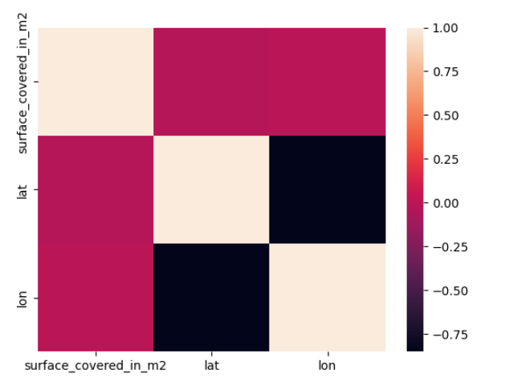

# Mexico City Real Estate Price Prediction

## Description

This project analyzes Mexico City apartment listings and builds a machine learning model to predict apartment prices in USD.

Each of the following files handles a specific part of the workflow:

- `extract.py` handles data loading and wrangling.
- `clean.py` handles inspection and preparation checks.
- `model.py` handles model training, baseline evaluation, prediction, and feature importance extraction.
- `visualize.py` handles exploratory visualizations and model interpretation charts.
- `main.py` runs the full project from start to finish.

The project uses real estate CSV files stored in the `data/` folder, filters the data to focus on apartments in Distrito Federal under USD 100,000, performs basic feature engineering, trains a Ridge Regression model, and visualizes both the data and the model feature importances.

---

## Project Structure

```text
project-folder/
│
├── assets/
│   ├── Distribution of Apartment prices histogram.png
│   ├── feature importance plot showing different coefficient weights.png
│   ├── feature-corelation-heatmap.png
│   ├── mapbox to show appartment dist by price using color.png
│   └── price vs area scatter.png
│
├── data/
│   ├── mexico-city-real-estate-1.csv
│   ├── mexico-city-real-estate-2.csv
│   ├── mexico-city-real-estate-3.csv
│   ├── mexico-city-real-estate-4.csv
│   ├── mexico-city-real-estate-5.csv
│   └── mexico-city-test-features.csv
│
├── extract.py
├── clean.py
├── model.py
├── visualize.py
├── main.py
└── README.md
```

---

## Project Flow

The project follows this pipeline:

```text
Raw CSV files
     │
     ▼
Data loading and wrangling
     │
     ▼
Data cleaning and inspection
     │
     ▼
Exploratory Data Analysis
     │
     ▼
Feature selection
     │
     ▼
Model building
     │
     ▼
Prediction on test data
     │
     ▼
Feature importance evaluation
     │
     ▼
Visualizations
```

The `main.py` file connects all the modules and runs them in sequence.

---

## Data Loading, Cleaning, and Wrangling

Data loading is handled in `extract.py`. The project reads the five real estate CSV files from the `data/` folder:

```python
files = glob.glob("data/mexico-city-real-estate-[1-5].csv")
```

Each file is passed through `wrangle()`, then the prepared dataframes are combined into one dataframe with `pd.concat()`.

The main cleaning and wrangling steps are:

- Keep only apartments in Distrito Federal priced below USD 100,000.
- Remove apartment-size outliers by keeping the 10th to 90th percentile of `surface_covered_in_m2`.
- Split `lat-lon` into separate `lat` and `lon` columns.
- Create a `borough` feature from `place_with_parent_names`.
- Drop columns with more than half missing values.
- Remove low-cardinality, high-cardinality, and leakage columns.

The target variable is `price_aprox_usd`.

---

## Data Cleaning and Inspection

`clean.py` performs light inspection after wrangling. It checks categorical columns, reviews category cardinality, lists the remaining columns, and creates a correlation matrix for numeric features.

The correlation matrix excludes the target column:

```python
corr = df.select_dtypes("number").drop(columns="price_aprox_usd").corr()
```

---

## Exploratory Data Analysis

EDA is handled in `visualize.py` and is focused on a few quick checks that summarize the cleaned apartment listing data before modeling:

- Correlation heatmap for numeric features.
- Histogram of apartment prices.
- Scatter plot of apartment price against apartment size.
- Mapbox plot showing apartment locations colored by price.

These charts show price distribution, area-price relationships, location patterns, and possible multicollinearity.

### Feature Correlation Heatmap

The correlation heatmap checks relationships between numeric features after cleaning. This helps identify whether predictors are strongly related to each other before fitting the model.



### Apartment Price Distribution

The histogram shows the distribution of apartment prices in the filtered dataset. Since the data is restricted to apartments below USD 100,000, this chart focuses on lower-priced Mexico City apartment listings.


### Price vs. Apartment Area

The scatter plot compares apartment price against covered surface area in square meters. It is used to inspect whether larger apartments tend to have higher prices and whether there are visible outliers or weak relationships.


### Geographic Distribution by Price

The Mapbox plot shows apartment locations across Mexico City, with color representing price. This helps inspect geographic price patterns and whether listings cluster in particular areas.


---

## Model Building

Model building is handled in `model.py`.

The model predicts `price_aprox_usd` using:

- `surface_covered_in_m2`
- `lat`
- `lon`
- `borough`

The workflow calculates a baseline MAE using the mean apartment price, then trains a Ridge Regression pipeline:

```python
model = make_pipeline(
    OneHotEncoder(use_cat_names=True),
    SimpleImputer(),
    Ridge()
)
```

The trained model is used to predict prices for `data/mexico-city-test-features.csv`.

## Results and Feature Importance

Feature importance is based on the Ridge model coefficients. The encoded feature names are matched with the coefficients, and the top features by absolute coefficient value are shown in a horizontal bar chart.


The feature importance chart shows which predictors have the largest positive or negative relationship with predicted apartment price in the fitted Ridge model. Larger absolute coefficient values indicate stronger influence on the model prediction.

---

## How to Run the Project

### 1. Install dependencies

Install the required Python libraries:

```bash
pip install pandas seaborn matplotlib plotly scikit-learn category-encoders
```

`glob` is imported directly in the project, but it is part of the Python standard library and does not need to be installed separately.

---

### 2. Prepare the data folder

Make sure your project has a `data/` folder with these files:

```text
data/mexico-city-real-estate-1.csv
data/mexico-city-real-estate-2.csv
data/mexico-city-real-estate-3.csv
data/mexico-city-real-estate-4.csv
data/mexico-city-real-estate-5.csv
data/mexico-city-test-features.csv
```

### 3. Run the whole project

From the project folder, run:

```bash
python main.py
```

This executes the full pipeline:

```text
extract.py
clean.py
model.py
visualize.py
```

---

## Output Produced by the Project

When the project runs, it produces:

- A cleaned dataframe for apartments in Distrito Federal.
- A numeric feature correlation matrix.
- A baseline mean absolute error.
- A trained Ridge Regression model.
- Price predictions for the test feature file.
- EDA charts for correlation, price distribution, area-price relationship, and geographic price distribution.
- A feature importance chart based on Ridge Regression coefficients.

---

## Important Notes

- The project expects the data files to be inside a folder named `data`.
- The saved charts are stored in the `assets/` folder and linked throughout this README.
- The visualizations will open when `main.py` is executed.
- The model uses Ridge Regression.
- The categorical `borough` feature is encoded using `OneHotEncoder`.
- The target variable is `price_aprox_usd`.
